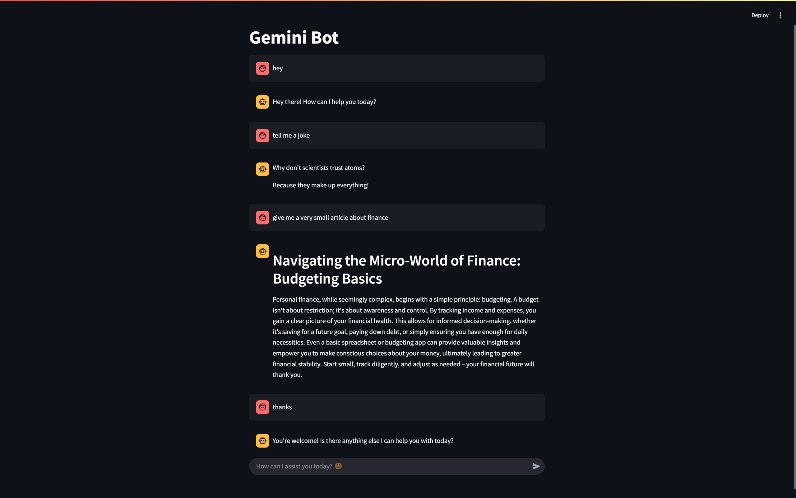

<a id="readme-top"></a>

<!-- TABLE OF CONTENTS -->
<details>
  <summary>Table of Contents</summary>
  <ol>
    <li>
      <a href="#about-the-project">About The Project</a>
      <ul>
        <li><a href="#built-with">Built With</a></li>
      </ul>
    </li>
    <li>
      <a href="#getting-started">Getting Started</a>
      <ul>
        <li><a href="#prerequisites">Prerequisites</a></li>
        <li><a href="#installation">Installation & Docker Setup</a></li>
      </ul>
    </li>
    <li><a href="#contact">Contact</a></li>
  </ol>
</details>

<!-- ABOUT THE PROJECT -->
## About The Project
<div align="center">
  
</div>

This project is an LLM-based Chatbot designed to provide intelligent, conversational experiences. It integrates a FastAPI backend with a Streamlit frontend, all containerized using Docker, to deliver a seamless chat interface.

<p align="right">(<a href="#readme-top">back to top</a>)</p>

### Built With
[![FastAPI][FastAPI-badge]][FastAPI-url]
[![Streamlit][Streamlit-badge]][Streamlit-url]
[![Docker][Docker-badge]][Docker-url]
[![Python][Python-badge]][Python-url]

[FastAPI-badge]: https://img.shields.io/badge/FastAPI-009688?style=for-the-badge&logo=fastapi&logoColor=white
[FastAPI-url]: https://fastapi.tiangolo.com/

[Streamlit-badge]: https://img.shields.io/badge/Streamlit-FF4B4B?style=for-the-badge&logo=streamlit&logoColor=white
[Streamlit-url]: https://streamlit.io/

[Docker-badge]: https://img.shields.io/badge/Docker-2496ED?style=for-the-badge&logo=docker&logoColor=white
[Docker-url]: https://www.docker.com/

[Python-badge]: https://img.shields.io/badge/Python-3776AB?style=for-the-badge&logo=python&logoColor=white
[Python-url]: https://www.python.org

<p align="right">(<a href="#readme-top">back to top</a>)</p>

## Getting Started

### Prerequisites
Ensure you have the following installed:
- [Docker](https://docs.docker.com/get-docker/)
- [Git](https://git-scm.com/downloads/win)
- [Python 3.12.6](https://www.python.org/downloads/release/python-3126/)

### Installation & Docker Setup <a id="installation"></a>

1. **Clone the Repository:**
    ```sh
    git clone https://github.com/YourUsername/LLM-Based-Chatbot.git
    ```
    ```sh
    cd ./LLM-Based-Chatbot/
    ```
2. **Create a `.env` file and add your key:**
   - Add `GOOGLE_API_KEY=your_actual_google_api_key_here`
3. **Run the Docker Compose setup:**
    ```sh
    docker-compose -f docker-compose-test.yml up
    ```
4. **Access the application:**
   - Streamlit Chatbot UI: [http://localhost:8501/](http://localhost:8501/)
   - FastAPI Backend: [http://localhost:8000](http://localhost:8000)

## Contact
* Saad Mohamed - [LinkedIn](https://www.linkedin.com/in/saad-mohamed-03573b24a/) - saad.2002.ms@gmail.com

[Project Link](https://github.com/MrSa3dola/LLM-Based-Chatbot)

<p align="right">(<a href="#readme-top">back to top</a>)</p>
